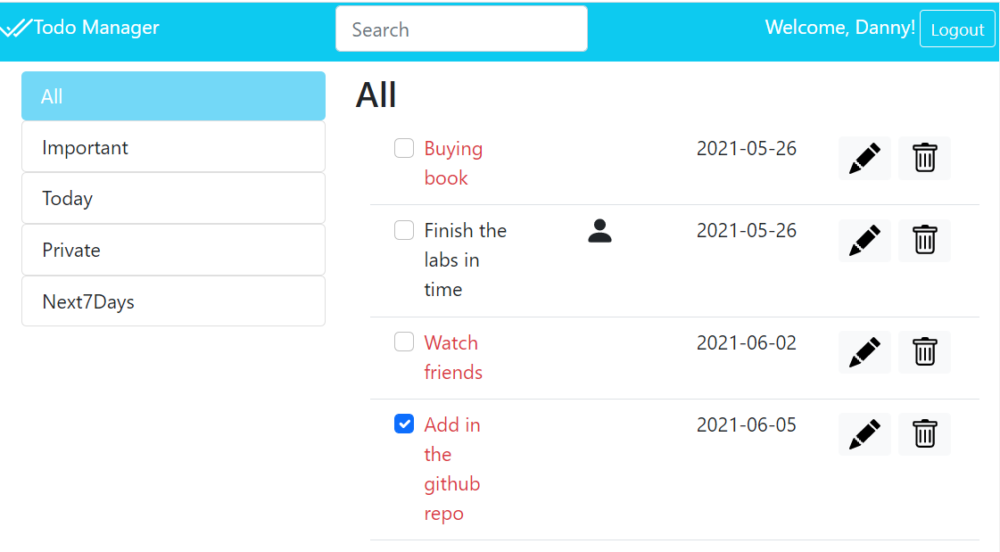

# Application To Manage All Tasks
Application to manage a list of Tasks
Functionalities provided by the application.
1. Create a Task 
2. Edit a Task 
3. Delete a Task 

### Home Page 


## APIs
Hereafter, we report the designed HTTP APIs, also implemented in the project.

### Logging in the user

URL: `/api/login`

HTTP Method: `POST`

Description: Perform the login for the user

Request body: `EMPTY`

Response: 

Response body:
```
{id, email, name}
```

### Info about the logged in User

URL: `/api/sessions/current`

HTTP Method: `GET`

Description: Get info about the current logged in user

Request body: `EMPTY`

Response: 

Response body:
```
{req.user}
```

### Logging out the current User

URL: `/api/sessions/current`

HTTP Method: `DELETE`

Description: Logging out the current User

Request body: `EMPTY`

Response: 

Response body: `EMPTY`

### List Task of the current User

URL: `/api/users/:id/tasks`

HTTP Method: `GET`

Description: Retrieve the list of all the tasks of the current user

Request body: `EMPTY`

Response: 

Response body:
[ {id, description, important, private, deadline, completed, user}, ... ]


### List Tasks

URL: `/api/tasks`

HTTP Method: `GET`

Description: Retrieve the list of all the tasks

Request body: `None`

Response: 200 ok (success) or 500 Internal Server Error

Response body: An array of objects , each describing a task 

[ 
    {
        "id": 1 , 
        "description" : "Buy a book", 
        "important" : true, 
        "private" : false, 
        "deadline" :"2021-02-01", 
        "completed" : false, 
        "user" : 1
    }, 
    ]

### Get a Task

URL: `/api/tasks/:id`

HTTP Method: `GET`

Description: Retrieve the attributes of the task with the specified id

Request body: `NONE`

Response: 200 OK (success), 404 Not Found (wrong code), or 500 Internal Server Error (generic error).   

Response body:
[
   {
        "id": 1 , 
        "description" : "Buy a book", 
        "important" : true, 
        "private" : false, 
        "deadline" :"2021-02-01", 
        "completed" : false, 
        "user" : 1
    }, 
]

### Filter list of Tasks

URL: `/api/tasks/filter/:filter`

HTTP Method: `GET`

Description: Retrieve the list of tasks that fulfill the filter request

Request body: `NONE`

Response:  200 OK (success), 404 Not Found (wrong code), or 500 Internal Server Error (generic error).

Response body:
[
   {
        "id": 1 , 
        "description" : "Buy a book", 
        "important" : true, 
        "private" : false, 
        "deadline" :"2021-02-01", 
        "completed" : false, 
        "user" : 1
    }, 
]


### Add a new Task

URL: `/api/addtask`

HTTP Method: `POST`

Description: Add a new Task in the database

Request body:  An object representing an task (Content-Type: application/json).
{
        "description" : "Buy a book", 
        "important" : true, 
        "private" : false, 
        "deadline" :"2021-02-01", 
        "completed" : false, 
        "user" : 1

}

Response: 201 Created (success) or 503 Service Unavailable 
          (generic error, e.g., when trying to insert an already existent task). If the request body is not valid, 422 Unprocessable Entity (validation error).

Response body: `NONE`


### Update a Task

URL: `'/api/updatetask/:id`

HTTP Method: `PUT`

Description: Update the attribute of the task with the specified id

Request body: An object representing the entire task 
              (Content-Type:application/json).{


Response: 200 OK (success) or 503 Service Unavailable (generic error). 
        If the request body is not valid, 422 Unprocessable Entity (validation error)

Response body:  None 


### Delete a Task

URL: `/api/deletetask/:id`

HTTP Method: `DELETE`

Description: Delete the task with the specified id

Request body: `None`

Response: 204 No Content (success) or 503 Service Unavailable (generic error)

Response body: `None`


